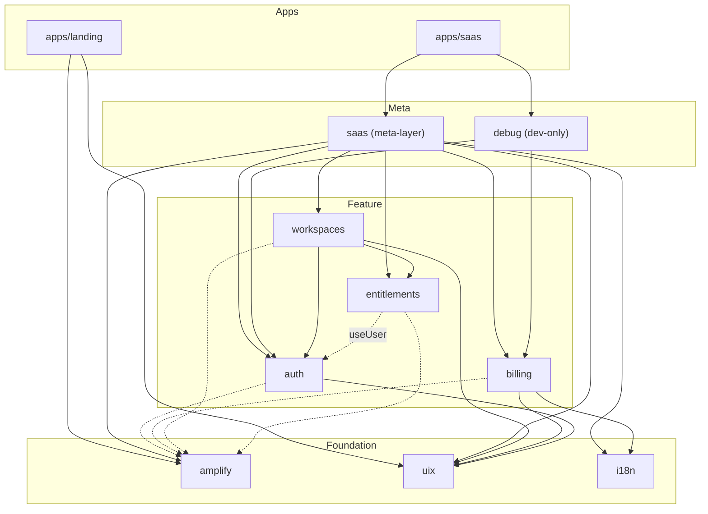
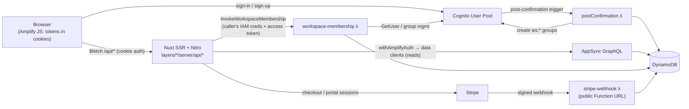

# Architecture Overview

> **Status**: Active · **Created**: 2026-07-08 · **Source**: AGENTS.md, doc/analysis/layer-dependencies.md

The architecture reference for this repository. Every capability claim below was verified against the code or the 2026-07-08 feature audit; where the implementation is incomplete, the [Current status](#current-status--known-gaps) section says so explicitly.

## System at a glance

A pnpm monorepo that composes **Nuxt 4 applications from reusable Nuxt Layers** on top of an **AWS Amplify Gen2 backend** (Cognito, AppSync/GraphQL, DynamoDB, Lambda) with **Stripe** for billing (portal-first).

| Concern | Technology | Where |
|---|---|---|
| Package manager | pnpm 10 workspaces (`corepack enable`), Node ≥ 20.19 | `pnpm-workspace.yaml`, root `package.json` |
| Frontend | Nuxt 4 + TypeScript (strict), composed via layer `extends` | `apps/saas`, `apps/landing`, `layers/*` |
| UI | `@nuxt/ui` v4 (MIT — **not** Nuxt UI Pro) + TailwindCSS v4 | `layers/uix` |
| Backend | Amplify Gen2: Cognito auth, AppSync Data, 3 Lambdas | `apps/backend/amplify/` |
| Billing | Stripe Checkout + Customer Portal; webhook = Lambda Function URL | `layers/billing`, `apps/backend/amplify/functions/stripe-webhook/` |
| Server API | Nitro routes under `layers/*/server/api/<layer>/`, wrapped in `withAmplifyAuth`/`withAmplifyPublic` | `layers/amplify/server/utils/amplify.ts` |

## Monorepo layout

```
starter-nuxt-amplify-saas/
├── apps/
│   ├── backend/              # @starter-nuxt-amplify-saas/backend — Amplify Gen2
│   │   └── amplify/          # backend.ts, auth/, data/, functions/, seed/
│   ├── saas/                 # @starter-nuxt-amplify-saas/saas — Nuxt 4 dashboard (SSR)
│   └── landing/              # @starter-nuxt-amplify-saas/landing — Nuxt 4 marketing site (SSG target; currently a shell)
├── layers/                   # 9 reusable Nuxt layers, published as @mmshark/<name>-layer
│   ├── amplify/  auth/  billing/  workspaces/  entitlements/
│   ├── uix/  i18n/  saas/  debug/
├── .context/                 # This documentation tree (prd/, architecture/, patterns/, …)
├── vitest.config.ts          # Unit tests (layers/**/__tests__, apps/**/__tests__)
└── package.json              # Root scripts (saas:dev, backend:sandbox:*, …)
```

Naming: layer packages are `@mmshark/<name>-layer`; the three apps are `@starter-nuxt-amplify-saas/{backend,saas,landing}`. Prefer package imports over relative `../..` paths across workspace boundaries.

## Layers and apps

### The 9 layers

| Layer | Package | `extends` (nuxt.config.ts) | Role |
|---|---|---|---|
| `layers/amplify` | `@mmshark/amplify-layer` | — | Nuxt ↔ Amplify glue: `$Amplify` client/server plugins, `withAmplifyAuth`/`withAmplifyPublic`, IAM/userPool data clients, `invokeWorkspaceMembership`, `createLogger` |
| `layers/uix` | `@mmshark/uix-layer` | — | Registers `@nuxt/ui` v4 + theme CSS (`layers/uix/assets/css/main.css`). Minimal by design: no own components/composables |
| `layers/i18n` | `@mmshark/i18n-layer` | — | Registers `@nuxtjs/i18n` (en/es, `prefix_except_default`, number/date formats). Infrastructure only — see gaps |
| `layers/auth` | `@mmshark/auth-layer` | `uix` | Cognito sign-in/up/verify (`Authenticator.vue`), `useUser()` SSR-safe session state, `auth` route middleware, profile routes |
| `layers/billing` | `@mmshark/billing-layer` | `uix`, `i18n` | Stripe checkout/portal Nitro routes, `useBilling()`, pricing components. The Stripe **webhook is not here** — it is a backend Lambda |
| `layers/entitlements` | `@mmshark/entitlements-layer` | — (standalone; uses `useUser()` from auth at runtime) | Plan/permission catalogs (`free/starter/pro/enterprise`; roles `user/admin/owner`), `useEntitlements()`, `FeatureGate`/`PermissionGuard`, server `getWorkspaceContext`/`requirePermission` |
| `layers/workspaces` | `@mmshark/workspaces-layer` | `auth`, `entitlements`, `uix` | Workspace CRUD, members, invitations; all tenant writes proxied to the `workspace-membership` Lambda |
| `layers/saas` | `@mmshark/saas-layer` | `amplify`, `uix`, `i18n`, `auth`, `billing`, `workspaces`, `entitlements` | Meta-layer: dashboard shell (layouts, navigation, settings/profile/auth pages) composing everything above |
| `layers/debug` | `@mmshark/debug-layer` | `auth`, `billing` | Dev-only debug pages (`/debug`, `/debug/plans`, `/debug/profile`); each page 404s in production via `import.meta.dev` guard |

Notes vs the old `doc/analysis/layer-dependencies.md` (stale there, corrected here — verified against each `nuxt.config.ts`/`package.json`):

- `debug` is **not** dependency-free: it extends `auth` and `billing`.
- There is **no** `POST /api/billing/webhook` Nitro route. Stripe calls the `stripe-webhook` Lambda Function URL directly.
- UI is `@nuxt/ui` v4 (MIT), not "Nuxt UI Pro".
- `extends` edges (Nuxt layer composition) and `peerDependencies` diverge deliberately: e.g. `layers/entitlements/package.json` peers on `@mmshark/workspaces-layer` while `workspaces` *extends* `entitlements`. `extends` is the acyclic composition graph; peers only declare "must be present in the final app". The `amplify` layer is not extended by feature layers — its `$Amplify` plugins and server utils are provided by the **app-level composition** (`saas` meta-layer extends it) and consumed at runtime.

### The 3 apps

| App | Composition | Deploy |
|---|---|---|
| `apps/saas` | extends `@mmshark/saas-layer` + `@mmshark/debug-layer`; `/auth/**` is client-only (`ssr: false` route rule) | Amplify Hosting SSR (`apps/saas/amplify.yml`) |
| `apps/landing` | extends `@mmshark/uix-layer` + `@mmshark/amplify-layer` (public data access for pricing) | Amplify Hosting (`apps/landing/amplify.yml`); intended SSG. **Currently renders only `NuxtWelcome` — no pages exist** |
| `apps/backend` | Amplify Gen2: `auth`, `data`, `postConfirmation`, `stripeWebhook`, `workspaceMembership` (`apps/backend/amplify/backend.ts`) | `ampx` sandbox / Amplify branch deploy (`apps/backend/amplify.yml`) |

### Dependency graph

Solid arrows = Nuxt `extends` (verified in each `nuxt.config.ts`). Dashed arrows = runtime dependency without `extends` (composables/server utils resolved through the final app composition).



`apps/backend` sits outside this graph: frontends couple to it only through the generated `amplify_outputs.json` (gitignored; statically imported by `layers/amplify` plugins and server utils — every frontend build therefore requires a deployed backend or generated outputs).

## Multi-tenant security model

Defined in `apps/backend/amplify/data/resource.ts`. Three pillars: **group-per-workspace read access**, **read-only tenant tables for clients**, and **three privileged Lambdas as the only writers**.

### Authorization modes

- `defaultAuthorizationMode: "userPool"` — Cognito JWT is the default principal.
- There is **no general-purpose public API key**: `allow.publicApiKey()` appears exactly once, read-only, on `SubscriptionPlan` (the landing page's public pricing table).
- `SubscriptionPlan` client writes are granted only to a static Cognito group `admin` — which **the backend never provisions**; in practice plan rows are seeded from Stripe (`pnpm backend:sandbox:seed:plans`, Stripe is the source of truth).

### Group-per-workspace

Every workspace gets two dynamic Cognito groups (created/deleted by the `workspace-membership` Lambda and the `postConfirmation` trigger; naming in `layers/amplify/server/utils/workspaceGroups.ts`):

| Group | Meaning |
|---|---|
| `ws:<workspaceId>:members` | Reader group — every member (any role) gets tenant-table read access via `allow.groupsDefinedIn('readerGroups')` |
| `ws:<workspaceId>:admins` | OWNER/ADMIN marker group — **not** itself a write grant |

Group claims are stamped into JWTs **at token-issue time**. Consequences (verified, operator-relevant):

- `useWorkspaces.createWorkspace()` force-refreshes the session after creating a workspace; accepting an invitation or a role change does **not** auto-refresh the affected user's session (sign out/in or `fetchAuthSession({ forceRefresh: true })` needed).
- A removed member's existing tokens keep working for **direct AppSync reads** until expiry (~1h). Nitro routes deny immediately (fail-closed, membership re-checked in DB).
- Pre-existing tenant rows from before this model (long-lived sandboxes) need a one-time backfill of groups + `readerGroups`/`writerGroups` fields, or those workspaces are invisible to their members.

### Tenant tables: read-only for clients

| Model | Client access | Privileged writers (`allow.resource`) |
|---|---|---|
| `Workspace` | read: owner, `readerGroups` | `workspace-membership` |
| `WorkspaceMember` | read: own row, `readerGroups` | `workspace-membership` |
| `WorkspaceSubscription` | read: `readerGroups` | `stripe-webhook`, `workspace-membership` |
| `WorkspaceInvitation` | read: `readerGroups` | `workspace-membership` |
| `ProcessedStripeEvent` | none | `stripe-webhook` |
| `UserProfile` | read: owner only | `postConfirmation` (schema-level grant) |
| `SubscriptionPlan` | read: public API key + any authenticated user | static `admin` group (unprovisioned); seeded from Stripe |

**No tenant table has a client write grant.** Every create/update/delete goes through one of the three Lambdas, each of which independently re-verifies the caller and never trusts the request payload.

### The 3 privileged Lambdas

| Lambda | Location | Trigger / caller | Trust model |
|---|---|---|---|
| `workspace-membership` | `apps/backend/amplify/functions/workspace-membership/` | Invoked from Nitro routes via `layers/amplify/server/utils/workspaceMembership.ts`, **signed with the caller's own authenticated Identity Pool credentials** (only the authenticated IAM role has `lambda:InvokeFunction`; never the guest role) | Calls Cognito `GetUser` on the forwarded access token to establish real identity, then re-checks OWNER/ADMIN role against the DB per action. 9 actions: create/update/delete workspace (cascade + group deletion), create/accept/decline invitation, update role, remove member, `ensureBilling`. Also manages the `ws:*` Cognito groups. Invitation tokens compared with `timingSafeEqual` |
| `stripe-webhook` | `apps/backend/amplify/functions/stripe-webhook/` | Public **Lambda Function URL** (`FunctionUrlAuthType.NONE`), exported as `custom.stripeWebhookUrl` in `amplify_outputs.json`. No IAM principal may invoke it — only Stripe hitting the URL | Verifies the Stripe signature against the raw body (`STRIPE_WEBHOOK_SECRET` Amplify secret) before parsing anything; syncs `WorkspaceSubscription`; dedupes via `ProcessedStripeEvent` + an event-ordering guard. **Stripe must be registered against this URL — there is no Nitro webhook route** |
| `postConfirmation` | `apps/backend/amplify/auth/post-confirmation/` | Cognito post-confirmation trigger | On sign-up confirmation, creates `UserProfile`, personal workspace, OWNER membership, free subscription, Stripe customer, and both `ws:*` groups **before first sign-in** (so first tokens carry the group claims). Caveat: it swallows all errors to avoid blocking registration — a user can end up confirmed without profile/workspace, with no retry mechanism |

## Request / data flow



Step by step:

1. **Session**: `layers/amplify/plugins/01.amplify.server.ts` configures Amplify per SSR request from the Cognito token cookies; `01.amplify.client.ts` exposes `$Amplify` (Auth, GraphQL client, Storage stubs) in the browser. Tokens (including the refresh token) live in **non-HttpOnly cookies** — inherent to the Amplify JS SSR adapter (see gaps).
2. **Reads**: pages/composables call Nitro routes (`/api/workspaces`, `/api/billing/*`, `/api/entitlements/*`, `/api/profile`). Handlers wrap in `withAmplifyAuth`/`withAmplifyPublic` (`layers/amplify/server/utils/amplify.ts`) and query AppSync with `getServerUserPoolDataClient` (caller's JWT → `groupsDefinedIn` read rules) or `getServerPublicDataClient`. The browser-side GraphQL client exists but is currently unused for data; **all data access flows through Nitro today** (no realtime subscriptions).
3. **Tenant writes**: Nitro routes never write tenant tables. They obtain the caller's Identity Pool credentials (`getAwsCredentials`) and invoke the `workspace-membership` Lambda (`invokeWorkspaceMembership`), forwarding the caller's access token; the Lambda re-authenticates and re-authorizes server-side, then writes via its `allow.resource` grant.
4. **Billing**: `POST /api/billing/checkout|portal` (in `layers/billing/server/api/billing/`) create Stripe sessions server-side — price IDs looked up server-side, `requirePermission('manage-billing')` enforced via `getWorkspaceContext` (`layers/entitlements/server/utils/getWorkspaceContext.ts`), redirect URLs derived from the `APP_BASE_URL` config, never from request headers. Stripe pushes subscription state back through the `stripe-webhook` Function URL.
5. **Provisioning**: sign-up confirmation fires `postConfirmation`, which provisions the personal workspace and groups before the first token is issued.

## Key invariants

1. **No client write path to tenant data.** All writes to `Workspace*`/`UserProfile`/`ProcessedStripeEvent` go through the 3 privileged Lambdas; clients (and Nitro routes acting as clients) hold read-only grants.
2. **Privileged code never trusts the payload.** `workspace-membership` derives identity from the access token via Cognito `GetUser` and re-checks roles in the DB; `stripe-webhook` trusts only the Stripe signature; `readerGroups`/`writerGroups` are always derived server-side, never from client input.
3. **Least-privilege invocation.** Only the authenticated Identity Pool role can invoke `workspace-membership` (signed with the caller's own credentials); no IAM principal can invoke `stripe-webhook`.
4. **`userPool` is the default auth mode**; the single API-key grant is read-only `SubscriptionPlan`.
5. **Tenant visibility = Cognito group membership** (`ws:<id>:members`), with the JWT-staleness caveats listed above; Nitro routes fail closed on stale claims.
6. **Stripe is the source of truth for plans** (rows synced via seed script); subscription state is synced only by the webhook Lambda (idempotent via `ProcessedStripeEvent`).
7. **Stripe redirect/return URLs come from configuration** (`APP_BASE_URL`), never from attacker-controllable `Host`/`X-Forwarded-*` headers.
8. **Frontends couple to the backend through `amplify_outputs.json`** — live outputs are generated
   and gitignored; offline CI provisions a committed-compatible stub through
   `task sandbox:outputs:stub`.
9. **Layer boundaries**: reusable code lives in layers, instance config in apps; server routes are namespaced `layers/<layer>/server/api/<layer>/…` and use the `withAmplifyAuth`/`withAmplifyPublic` wrappers (see [../patterns/api-server.md](../patterns/api-server.md), [../patterns/layers.md](../patterns/layers.md), [../patterns/composables.md](../patterns/composables.md)).
10. **`debug` layer is dev-only** — every page guards with `if (!import.meta.dev) throw createError(404)`; it is nonetheless composed into production builds (runtime guard only).

## Current status / known gaps

Architecture-level gaps originally confirmed by the 2026-07-08 audit and reconciled after completed
E01–E03/E05. Sequencing lives in the [Now/Next/Later roadmap](../prd/roadmap.md).

| Gap | Reality |
|---|---|
| File storage | **No S3/storage resource exists** in `apps/backend/amplify/backend.ts`. `$Amplify.Storage` plumbing in `layers/amplify` is a stub — any `uploadData`/`getUrl` call fails at runtime |
| Logging | `createLogger` exists but has zero production consumers; docs now mark it unadopted and E10 decides adopt-or-delete |
| App-level security hardening | No security headers (CSP/HSTS), no CSRF tokens (SameSite=Lax cookies only), no rate limiting on Nitro, AppSync, or the webhook Function URL |
| Session storage | Cognito tokens (incl. refresh token) in non-HttpOnly cookies — XSS would exfiltrate the session (Amplify JS SSR adapter pattern) |
| Entitlements wiring | Cookie/hydration defects are fixed and server enforcement is real; client gating components/middleware still have no product consumers |
| Invitations end-to-end | Backend + routes exist, but **no email is ever sent** (no email provider in the repo) and no acceptance page consumes the accept/decline endpoints |
| i18n | Module + locale files registered, but zero `$t()`/`useI18n()` consumers — all UI strings hardcoded English |
| Landing | `apps/landing` has no pages (default `NuxtWelcome`); the public plans API is verified by E05 but not yet consumed by landing |
| Realtime | No AppSync subscriptions/`observeQuery` usage anywhere; the exposed browser GraphQL client is unused |

## Related documents

- [../prd/roadmap.md](../prd/roadmap.md) — phased plan to close the gaps above
- [../patterns/layers.md](../patterns/layers.md), [../patterns/api-server.md](../patterns/api-server.md), [../patterns/composables.md](../patterns/composables.md), [../patterns/error-handling.md](../patterns/error-handling.md) — mandatory implementation patterns
- `AGENTS.md` (repo root) — contributor/agent operating guide (tech stack, commands, workflows)
- `apps/backend/amplify/data/resource.ts` — the authoritative, heavily commented security model source
