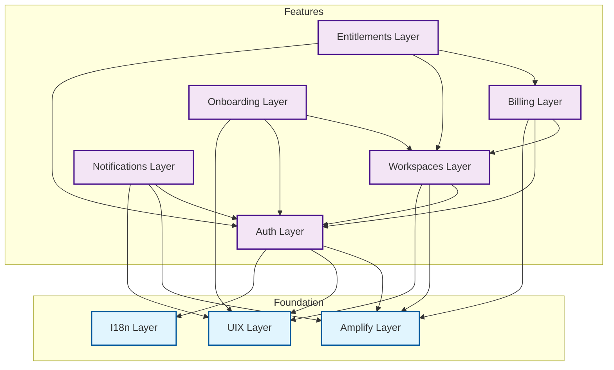

# SaaS Application Architecture

## Context
We are building a modern, scalable, and maintainable SaaS application. The requirements include:
- **Multi-tenancy**: Workspace-based data isolation.
- **Full-stack Type Safety**: End-to-end type safety from database to client.
- **Modularity**: Ability to develop, test, and deploy features independently.
- **Cloud-Native**: Leveraging serverless infrastructure for scalability and low maintenance.
- **Developer Experience**: Fast builds, clear structure, and robust tooling.

## Decision
We have decided to adopt a **Nuxt 4 Monorepo Architecture** using **pnpm workspaces** and **Nuxt Layers**, backed by **AWS Amplify Gen2**.

### 1. Monorepo Structure
We use `pnpm workspaces` to manage multiple applications and shared layers in a single repository.
- `apps/`: Deployable applications (SaaS Dashboard, Landing Page, Backend).
- `layers/`: Reusable feature and enabling modules.

### 2. Layered Architecture
We distinguish between two types of layers to maintain separation of concerns:

#### Enabling Layers (Infrastructure & Foundation)
These layers provide technical capabilities used by other layers.
- **Amplify Layer** (`layers/amplify`): AWS integration, GraphQL client, storage.
- **UIX Layer** (`layers/uix`): Design system, Nuxt UI Pro, Tailwind CSS.
- **I18n Layer** (`layers/i18n`): Internationalization and formatting.

#### Feature Layers (Business Capabilities)
These layers implement specific business domains.
- **Auth Layer** (`layers/auth`): Authentication flows (Cognito).
- **Billing Layer** (`layers/billing`): Subscription management (Stripe).
- **Workspaces Layer** (`layers/workspaces`): Multi-tenancy and team management.
- **Entitlements Layer** (`layers/entitlements`): RBAC and feature access control.
- **Onboarding Layer** (`layers/onboarding`): User activation flows.
- **Notifications Layer** (`layers/notifications`): System-wide notifications.

### 3. Technology Stack & Dependencies
- **Framework**: Nuxt 4 (Vue 3)
- **Language**: TypeScript
- **Package Manager**: pnpm
- **Backend**: AWS Amplify Gen2 (Cognito, AppSync, DynamoDB)
- **API**: GraphQL (Amplify) + Server API Endpoints (Custom Logic)
- **UI Library**: Nuxt UI Pro + Tailwind CSS
- **Payments**: Stripe
- **Testing**: Playwright (E2E), Vitest (Unit)

### 4. Layer Dependencies

To avoid circular dependencies and maintain a clean architecture, we enforce a strict unidirectional dependency flow.

#### Dependency Graph

#### Rationale

1.  **Auth Layer**: The base of user identity. It depends only on infrastructure layers.
2.  **Workspaces Layer**: Depends on **Auth** because workspaces have members (Users). It does *not* depend on Billing. A workspace exists independently of its subscription status.
3.  **Billing Layer**: Depends on **Workspaces** because subscriptions are attached to workspaces (Workspace-based billing). It needs the Workspace ID to create subscriptions.
4.  **Entitlements Layer**: The consumer of all state. It depends on:
    *   **Billing** (to check the current Plan).
    *   **Workspaces** (to check the User's Role).
    *   **Auth** (to check User identity).
    It aggregates this information to answer: *"Can this user perform this action in this workspace?"*
5.  **Onboarding Layer**: Orchestrates the initial setup. Depends on **Auth** and **Workspaces** to create the initial environment.
6.  **Notifications Layer**: Depends on **Auth** to target users and **Amplify** for delivery/storage.

#### Specific Case: Billing vs. Workspaces
*   **Billing depends on Workspaces**: ✅ Yes. The `WorkspaceSubscription` model has a foreign key to `Workspace`. The checkout flow requires a `workspaceId`.
*   **Workspaces depends on Billing**: ❌ No. The core workspace management (create, invite, switch) does not need to know about Stripe or subscriptions. This prevents circular dependencies.

## Consequences

### Benefits
- **Modularity**: Features are encapsulated, making the codebase easier to navigate and maintain.
- **Reusability**: Layers can be reused across different applications (e.g., Auth in both SaaS and Admin apps).
- **Type Safety**: Shared types ensure contract validity across the stack.
- **Scalability**: Serverless backend scales automatically; monorepo supports team growth.

### Trade-offs
- **Complexity**: Initial setup is more complex than a monolithic Nuxt app.
- **Build Times**: CI/CD pipelines need optimization to handle multiple apps and layers.
- **Learning Curve**: Developers need to understand the layer system and Amplify Gen2 concepts.
