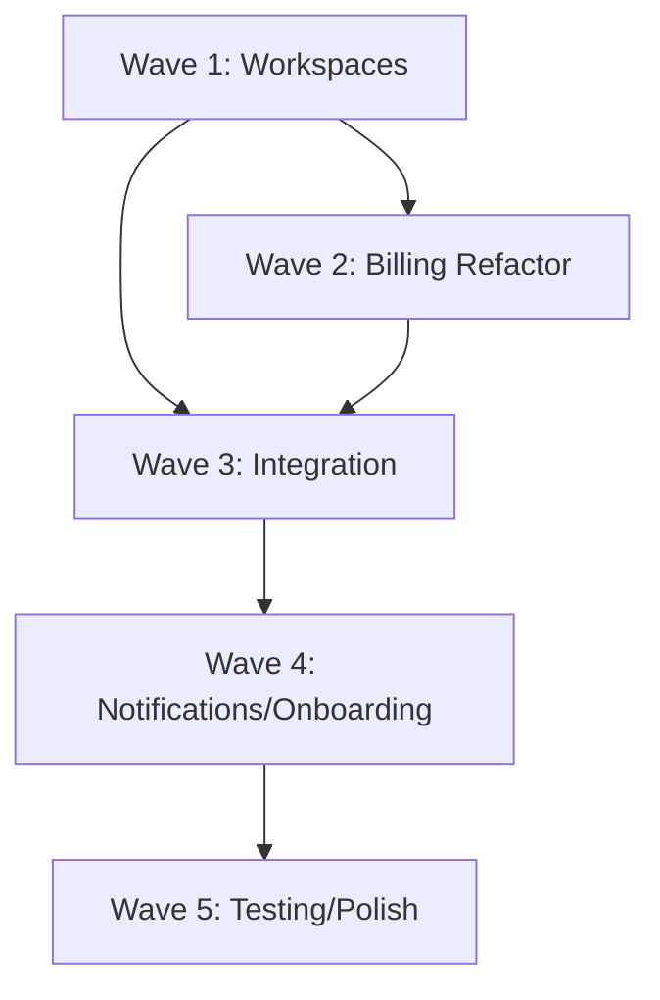

# Plan Global de Implementación - Starter Nuxt Amplify SaaS

**Fecha Creación**: 2024-11-24
**Versión**: 1.0
**Estado Proyecto**: 55-60% completado
**Timeline MVP**: 5-7 semanas (Waves 1-3)
**Timeline Full**: 12-14 semanas (Waves 1-5)

---

## 📋 Tabla de Contenidos

1. [Contexto y Resumen Ejecutivo](#contexto-y-resumen-ejecutivo)
2. [Visión General de Waves](#visión-general-de-waves)
3. [Wave 1: Workspaces Foundation](#wave-1-workspaces-foundation) ⚡ CRÍTICO
4. [Wave 2: Billing Refactor](#wave-2-billing-refactor) ⚡ CRÍTICO
5. [Wave 3: Integration & API Completion](#wave-3-integration--api-completion) 🔥 MVP
6. [Wave 4: Notifications & Onboarding](#wave-4-notifications--onboarding) ✨ ENHANCE
7. [Wave 5: Testing & Polish](#wave-5-testing--polish) 🎯 QUALITY
8. [Matriz de Dependencias](#matriz-de-dependencias)
9. [Métricas de Progreso](#métricas-de-progreso)
10. [Guía de Uso](#guía-de-uso)

---

## Contexto y Resumen Ejecutivo

### Estado Actual del Proyecto

Basado en el **Gap Analysis Report** (doc/analysis/gap-analysis-report.md):

**Completitud Global**: ~55-60% implementado

**Por Capas**:
- ✅ **COMPLETO (100%)**: UIX, I18n, Debug, Amplify (base)
- 🟢 **CASI COMPLETO (85-95%)**: Entitlements (95%), Auth (90%), Billing (95%), Workspaces (90%)
- 🟡 **PARCIAL (30%)**: Testing (30%)
- ❌ **NO IMPLEMENTADO (0%)**: Notifications, Onboarding

> **Nota**: tRPC ha sido deprecado en favor de REST API (ver api-server.pattern.md). Los endpoints existentes usan correctamente el patrón REST.

### Brechas Críticas

1. **🚨 BLOQUEANTE**: Workspaces layer completamente ausente (0%)
   - Sin workspaces, el sistema multi-tenant no funciona
   - Billing y Entitlements dependen de Workspaces (según ADR)

2. **🚨 CRÍTICO**: Inconsistencia arquitectónica en Billing
   - ADR especifica workspace-level billing
   - Implementación actual es user-level billing
   - Requiere refactoring completo del schema

3. **⚠️ IMPORTANTE**: Features de UX sin implementar
   - Notifications layer (0%)
   - Onboarding layer (0%)

### Estrategia del Plan

Este plan organiza la implementación en **5 Waves** de cambios atómicos:

1. **Wave 1-2**: Resolver blockers críticos (Workspaces + Billing refactor)
2. **Wave 3**: Completar MVP funcional (Integration + API Completion)
3. **Wave 4**: Mejorar UX (Notifications + Onboarding)
4. **Wave 5**: Calidad y polish (Testing + Production ready)

**Principios**:
- ✅ Cada cambio es atómico y committeable
- ✅ Orden secuencial respeta dependencias
- ✅ Testing incorporado en cada wave
- ✅ Rollback posible en cada paso
- ✅ Referencias a planes específicos para detalles

---

## Visión General de Waves

| Wave | Objetivo | Duración | Criticidad | Cambios | Estado Esperado |
|------|----------|----------|------------|---------|-----------------|
| **1** | Workspaces Foundation | 3-4 sem | 🚨 BLOCKER | W1.1-W1.13 | 70% completitud |
| **2** | Billing Refactor | 1.5-2 sem | 🚨 CRITICAL | W2.1-W2.7 | 80% completitud |
| **3** | Integration & API Completion | 2-3 sem | 🔥 MVP | W3.1-W3.8 | 85% completitud (MVP) |
| **4** | Notifications & Onboarding | 4 sem | ✨ ENHANCE | W4.1-W4.11 | 95% completitud |
| **5** | Testing & Polish | 2-3 sem | 🎯 QUALITY | W5.1-W5.8 | 100% completitud |

**Timeline Acumulado**:
- **MVP Ready**: 5-7 semanas (Waves 1-3)
- **Full Product**: 12-14 semanas (Waves 1-5)

---

## Wave 1: Workspaces Foundation

**Objetivo**: Implementar capa Workspaces desde cero (0% → 90%)
**Duración**: 3-4 semanas
**Criticidad**: 🚨 BLOCKER (sin esto, multi-tenancy no funciona)
**Dependencias**: Ninguna
**Detalles**: Ver `doc/plan/workspaces.md`

### W1.1: Crear GraphQL Schema - Workspace Model

**Descripción**: Definir modelo Workspace en Amplify data schema con campos base y relaciones.

**Commit Message**:
```
feat(amplify): add Workspace GraphQL model

- Define Workspace model with id, name, slug, ownerId
- Add authorization rules (owner, members)
- Add GSI for owner queries
- Add timestamps (createdAt, updatedAt)

Refs: doc/prd/workspaces.md, doc/adr/workspace-billing.md
```

**Ámbito**:
- `apps/backend/amplify/data/resource.ts`

**Guías de Alto Nivel**:
1. Añadir modelo Workspace con campos: workspaceId, name, slug, ownerId, settings
2. Configurar authorization: owner tiene full access, members read-only
3. Añadir GSI para queries por ownerId
4. Agregar hasMany relationship con WorkspaceMember
5. Validar schema localmente antes de commit

**Detalles**: Ver `doc/plan/workspaces.md` sección "Data Models"

**Dependencias**: Ninguna

**Testing**:
```bash
# Validar schema syntax
amplify sandbox --profile dev

# Query test en GraphQL Explorer
query ListWorkspaces { listWorkspaces { items { id name } } }
```

**Rollback**: Revert commit, redeploy schema anterior

---

### W1.2: Crear GraphQL Schema - WorkspaceMember Model

**Descripción**: Definir modelo WorkspaceMember para gestión de miembros y roles.

**Commit Message**:
```
feat(amplify): add WorkspaceMember GraphQL model

- Define WorkspaceMember model with workspaceId, userId, role
- Add composite key (workspaceId + userId)
- Add authorization rules (workspace scoped)
- Add role enum (Owner, Admin, Member)
- Add joinedAt timestamp

Refs: doc/prd/workspaces.md
```

**Ámbito**:
- `apps/backend/amplify/data/resource.ts`

**Guías de Alto Nivel**:
1. Crear modelo WorkspaceMember con composite key
2. Definir enum para roles: Owner, Admin, Member
3. Establecer belongsTo relationship con Workspace
4. Configurar authorization workspace-scoped
5. Añadir timestamp joinedAt

**Detalles**: Ver `doc/plan/workspaces.md` sección "Member Management"

**Dependencias**: W1.1 (Workspace model debe existir)

**Testing**:
```bash
# Query members de un workspace
query GetMembers($workspaceId: ID!) {
  listWorkspaceMembers(filter: { workspaceId: { eq: $workspaceId } }) {
    items { userId role joinedAt }
  }
}
```

**Rollback**: Revert commit + W1.1

---

### W1.3: Crear GraphQL Schema - WorkspaceInvitation Model

**Descripción**: Definir modelo WorkspaceInvitation para sistema de invitaciones con JWT.

**Commit Message**:
```
feat(amplify): add WorkspaceInvitation GraphQL model

- Define WorkspaceInvitation model
- Add fields: invitationId, workspaceId, email, role, token
- Add status enum (Pending, Accepted, Declined, Expired)
- Add expiration logic (expiresAt field)
- Add authorization rules

Refs: doc/prd/workspaces.md
```

**Ámbito**:
- `apps/backend/amplify/data/resource.ts`

**Guías de Alto Nivel**:
1. Crear modelo WorkspaceInvitation
2. Añadir campos: email, role, token (JWT), status, expiresAt
3. Definir status enum: Pending, Accepted, Declined, Expired
4. Configurar authorization (workspace owner can create)
5. Añadir index para queries por email

**Detalles**: Ver `doc/plan/workspaces.md` sección "Invitation System"

**Dependencias**: W1.1, W1.2

**Testing**:
```bash
# Crear invitación test
mutation CreateInvitation {
  createWorkspaceInvitation(input: {
    workspaceId: "test-ws"
    email: "test@example.com"
    role: Member
  }) { id status }
}
```

**Rollback**: Revert commits W1.1-W1.3

---

### W1.4: Deploy Schema y Crear Seeders

**Descripción**: Desplegar schema a Amplify y crear seeders para datos de prueba.

**Commit Message**:
```
feat(amplify): deploy workspace schema and add seeders

- Deploy Workspace, WorkspaceMember, WorkspaceInvitation models
- Create seed scripts for test data
- Add sample workspaces with members
- Add development data fixtures

Refs: doc/plan/workspaces.md
```

**Ámbito**:
- `apps/backend/amplify/data/resource.ts` (deployed)
- `apps/backend/amplify/data/seed-workspaces.ts` (new)

**Guías de Alto Nivel**:
1. Deploy schema a Amplify sandbox: `amplify sandbox`
2. Crear archivo seed-workspaces.ts con datos de prueba
3. Poblar 2-3 workspaces de ejemplo con miembros
4. Crear invitaciones de prueba en diferentes estados
5. Documentar datos de prueba en README

**Detalles**: Ver `doc/plan/workspaces.md` sección "Testing Data"

**Dependencias**: W1.1, W1.2, W1.3

**Testing**:
```bash
# Run seeders
npm run seed:workspaces

# Verificar data
amplify sandbox
# Query workspaces en GraphQL Explorer
```

**Rollback**: Drop tables, revert deployment

---

### W1.5: Implementar useWorkspaces Composable - CRUD Básico

**Descripción**: Crear composable useWorkspaces con operaciones CRUD básicas.

**Commit Message**:
```
feat(workspaces): implement useWorkspaces composable with CRUD

- Create useWorkspaces composable
- Add create, read, update, delete operations
- Add reactive state management
- Add error handling
- Add loading states
- Export workspace types

Refs: doc/prd/workspaces.md
```

**Ámbito**:
- `layers/workspaces/composables/useWorkspaces.ts` (new)
- `layers/workspaces/types/workspace.ts` (new)
- `layers/workspaces/nuxt.config.ts` (new layer)

**Guías de Alto Nivel**:
1. Crear directorio `layers/workspaces/`
2. Implementar useWorkspaces composable con:
   - `createWorkspace(name, slug)`
   - `getWorkspace(id)`
   - `updateWorkspace(id, data)`
   - `deleteWorkspace(id)`
   - `listWorkspaces()`
3. Añadir reactive state: `currentWorkspace`, `workspaces`, `loading`, `error`
4. Integrar con Amplify GraphQL client
5. Añadir type definitions TypeScript

**Detalles**: Ver `doc/plan/workspaces.md` sección "Composable API"

**Dependencias**: W1.4 (schema deployed)

**Testing**:
```typescript
// En componente de prueba
const { createWorkspace, listWorkspaces } = useWorkspaces()

// Test crear workspace
await createWorkspace({ name: 'Test Workspace', slug: 'test-ws' })

// Test listar
const workspaces = await listWorkspaces()
console.log(workspaces.value)
```

**Rollback**: Revert commit, remover layer

---

### W1.6: Implementar Workspace Invitation Logic (JWT)

**Descripción**: Añadir lógica de invitaciones con JWT tokens al composable.

**Commit Message**:
```
feat(workspaces): add invitation system with JWT tokens

- Add inviteToWorkspace() method
- Implement JWT token generation
- Add acceptInvitation() method
- Add declineInvitation() method
- Add invitation validation logic
- Add expiration checks

Refs: doc/prd/workspaces.md
```

**Ámbito**:
- `layers/workspaces/composables/useWorkspaces.ts` (update)
- `layers/workspaces/server/utils/jwt.ts` (new)
- `layers/workspaces/types/invitation.ts` (new)

**Guías de Alto Nivel**:
1. Añadir métodos al composable:
   - `inviteToWorkspace(workspaceId, email, role)`
   - `acceptInvitation(token)`
   - `declineInvitation(token)`
   - `validateInvitation(token)`
2. Implementar JWT generation en server utils
3. Añadir expiration logic (7 días por defecto)
4. Implementar verificación de token
5. Añadir email notification trigger (stub por ahora)

**Detalles**: Ver `doc/plan/workspaces.md` sección "Invitation Flow"

**Dependencias**: W1.5

**Testing**:
```typescript
// Test invitation flow
const { inviteToWorkspace, acceptInvitation } = useWorkspaces()

// Invitar usuario
const invitation = await inviteToWorkspace({
  workspaceId: 'ws-123',
  email: 'user@example.com',
  role: 'Member'
})

// Aceptar invitación
await acceptInvitation(invitation.token)
```

**Rollback**: Revert commit

---

### W1.7: Crear Workspace REST API Endpoints

**Descripción**: Implementar REST API endpoints para operaciones CRUD de workspaces.

**Commit Message**:
```
feat(workspaces): add REST API endpoints with CRUD operations

- Create workspace API endpoints
- Add CRUD operations (create, get, update, delete, list)
- Add Zod validation schemas
- Add authorization checks
- Integrate with Amplify context via withAmplifyAuth

Refs: doc/adr/patterns/api-server.pattern.md, doc/prd/workspaces.md
```

**Ámbito**:
- `layers/workspaces/server/api/workspaces/index.get.ts` (new)
- `layers/workspaces/server/api/workspaces/index.post.ts` (new)
- `layers/workspaces/server/api/workspaces/[id].get.ts` (new)
- `layers/workspaces/server/api/workspaces/[id].patch.ts` (new)
- `layers/workspaces/server/api/workspaces/[id].delete.ts` (new)

**Guías de Alto Nivel**:
1. Crear REST API endpoints en layers/workspaces/server/api/workspaces/
2. Implementar endpoints:
   - `GET /api/workspaces`: listar workspaces del usuario
   - `POST /api/workspaces`: crear workspace
   - `GET /api/workspaces/[id]`: obtener workspace por ID
   - `PATCH /api/workspaces/[id]`: actualizar workspace
   - `DELETE /api/workspaces/[id]`: eliminar workspace
3. Añadir Zod schemas para validación
4. Usar withAmplifyAuth para autenticación
5. Implementar authorization checks (owner only para delete)

**Detalles**: Ver `doc/plan/workspaces.md` sección "REST API Endpoints"

**Dependencias**: W1.5, W1.6

**Testing**:
```typescript
// Test via $fetch
const workspaces = await $fetch('/api/workspaces')

const workspace = await $fetch('/api/workspaces', {
  method: 'POST',
  body: { name: 'Test Workspace', slug: 'test-ws' }
})
```

**Rollback**: Revert commit

---

### W1.8: Crear Workspace Middleware - Context Loading

**Descripción**: Implementar middleware para cargar workspace context en requests.

**Commit Message**:
```
feat(workspaces): add workspace middleware for context loading

- Create workspace.ts middleware
- Add workspaceId from route params or header
- Load workspace data and members
- Add workspace to context
- Add role checking middleware
- Handle workspace not found errors

Refs: doc/prd/workspaces.md
```

**Ámbito**:
- `layers/workspaces/middleware/workspace.ts` (new)
- `layers/workspaces/middleware/workspaceRole.ts` (new)

**Guías de Alto Nivel**:
1. Crear middleware workspace.ts:
   - Extraer workspaceId de route params o header
   - Cargar workspace y membership del usuario actual
   - Añadir workspace context a navigateTo
   - Manejar errores (workspace not found, no access)
2. Crear middleware workspaceRole.ts:
   - Verificar rol del usuario en workspace
   - Permitir/denegar acceso según rol requerido
   - Redirigir a error page si no autorizado
3. Documentar uso en README

**Detalles**: Ver `doc/plan/workspaces.md` sección "Middleware"

**Dependencias**: W1.7

**Testing**:
```typescript
// En página protegida
definePageMeta({
  middleware: ['workspace', 'workspace-role:admin']
})

// Acceder workspace en componente
const workspace = useWorkspaceContext()
```

**Rollback**: Revert commit

---

### W1.9: Implementar WorkspaceSelector Component

**Descripción**: Crear componente UI para seleccionar workspace activo.

**Commit Message**:
```
feat(workspaces): add WorkspaceSelector component

- Create WorkspaceSelector dropdown component
- Add workspace list with search
- Add workspace switching logic
- Add create workspace CTA
- Style with Nuxt UI components
- Add keyboard navigation

Refs: doc/prd/workspaces.md, doc/prd/uix.md
```

**Ámbito**:
- `layers/workspaces/components/WorkspaceSelector.vue` (new)

**Guías de Alto Nivel**:
1. Crear componente WorkspaceSelector.vue
2. Implementar dropdown con lista de workspaces del usuario
3. Añadir search/filter functionality
4. Implementar workspace switching (update URL param o cookie)
5. Añadir opción "Create New Workspace"
6. Usar Nuxt UI components (UDropdown, UButton, etc.)
7. Añadir keyboard shortcuts (Cmd+K para abrir)

**Detalles**: Ver `doc/plan/workspaces.md` sección "UI Components"

**Dependencias**: W1.5, W1.6

**Testing**:
```vue
<template>
  <WorkspaceSelector />
</template>

<!-- Test switching workspaces -->
<!-- Test creating new workspace -->
<!-- Test search functionality -->
```

**Rollback**: Revert commit

---

### W1.10: Implementar MemberList Component

**Descripción**: Crear componente UI para listar y gestionar miembros de workspace.

**Commit Message**:
```
feat(workspaces): add MemberList component

- Create MemberList table component
- Display members with role badges
- Add remove member action (owner/admin only)
- Add update role action
- Add member avatar and info
- Add empty state

Refs: doc/prd/workspaces.md
```

**Ámbito**:
- `layers/workspaces/components/MemberList.vue` (new)

**Guías de Alto Nivel**:
1. Crear componente MemberList.vue
2. Fetch workspace members via useWorkspaces
3. Display table con: avatar, name, email, role, joinedAt
4. Añadir role badges (Owner, Admin, Member)
5. Implementar remove member action (con confirmación)
6. Implementar update role dropdown
7. Añadir empty state cuando no hay members

**Detalles**: Ver `doc/plan/workspaces.md` sección "Member Management UI"

**Dependencias**: W1.5

**Testing**:
```vue
<template>
  <MemberList workspace-id="ws-123" />
</template>

<!-- Test displaying members -->
<!-- Test removing member -->
<!-- Test updating roles -->
```

**Rollback**: Revert commit

---

### W1.11: Implementar InvitationForm Component

**Descripción**: Crear componente UI para invitar nuevos miembros.

**Commit Message**:
```
feat(workspaces): add InvitationForm component

- Create InvitationForm modal component
- Add email input with validation
- Add role selector dropdown
- Add invitation sending logic
- Add success/error feedback
- Add multiple invitations support

Refs: doc/prd/workspaces.md
```

**Ámbito**:
- `layers/workspaces/components/InvitationForm.vue` (new)

**Guías de Alto Nivel**:
1. Crear componente InvitationForm.vue (modal)
2. Implementar form con campos:
   - Email input (validación email format)
   - Role selector (Owner/Admin/Member)
   - Optional: multiple emails
3. Integrar con useWorkspaces.inviteToWorkspace()
4. Añadir loading state durante envío
5. Mostrar success toast después de enviar
6. Manejar errores (email ya invitado, etc.)

**Detalles**: Ver `doc/plan/workspaces.md` sección "Invitation UI"

**Dependencias**: W1.6

**Testing**:
```vue
<template>
  <UButton @click="isOpen = true">Invite Member</UButton>
  <InvitationForm v-model="isOpen" :workspace-id="workspaceId" />
</template>

<!-- Test sending invitation -->
<!-- Test validation errors -->
<!-- Test multiple invitations -->
```

**Rollback**: Revert commit

---

### W1.12: Crear Workspace Settings Pages

**Descripción**: Implementar páginas de settings para workspace management.

**Commit Message**:
```
feat(workspaces): add workspace settings pages

- Create workspace settings layout
- Add general settings page (name, slug)
- Add members management page
- Add workspace deletion page
- Add navigation tabs
- Integrate all workspace components

Refs: doc/prd/workspaces.md, doc/prd/saas.md
```

**Ámbito**:
- `apps/saas/app/pages/settings/workspace/index.vue` (new)
- `apps/saas/app/pages/settings/workspace/members.vue` (new)
- `apps/saas/app/pages/settings/workspace/general.vue` (new)

**Guías de Alto Nivel**:
1. Crear estructura `/settings/workspace/` en apps/saas
2. Implementar general settings:
   - Edit workspace name
   - Edit workspace slug
   - Upload workspace logo (futuro)
3. Implementar members page:
   - Integrar MemberList component
   - Integrar InvitationForm component
4. Implementar danger zone:
   - Delete workspace action (con confirmación múltiple)
5. Añadir navigation tabs entre secciones

**Detalles**: Ver `doc/plan/workspaces.md` sección "Settings UI"

**Dependencias**: W1.9, W1.10, W1.11

**Testing**:
```bash
# Navegar a /settings/workspace
# Test editar nombre de workspace
# Test gestionar miembros
# Test eliminar workspace
```

**Rollback**: Revert commit

---

### W1.13: Integrar Workspaces con Auth Layer

**Descripción**: Conectar workspaces con auth para crear workspace default en signup.

**Commit Message**:
```
feat(workspaces): integrate with auth layer for default workspace

- Create default workspace on user signup
- Update post-confirmation Lambda
- Add workspace creation to user onboarding
- Set user as workspace owner
- Add workspace context to user session

Refs: doc/prd/auth.md, doc/prd/workspaces.md
```

**Ámbito**:
- `apps/backend/amplify/auth/post-confirmation/handler.ts` (update)
- `layers/auth/composables/useUser.ts` (update)

**Guías de Alto Nivel**:
1. Actualizar post-confirmation Lambda:
   - Crear workspace default cuando usuario se registra
   - Nombrar workspace "Personal" o con nombre del usuario
   - Asignar usuario como Owner
2. Actualizar useUser composable:
   - Añadir campo `currentWorkspaceId` al user state
   - Fetch workspace en fetchUser()
3. Añadir workspace switching logic
4. Persistir currentWorkspaceId en localStorage/cookie

**Detalles**: Ver `doc/plan/workspaces.md` sección "Auth Integration"

**Dependencias**: W1.5, W1.7

**Testing**:
```bash
# Registrar nuevo usuario
# Verificar que se creó workspace default
# Verificar que usuario es owner
```

**Rollback**: Revert commit, limpiar workspaces creados

---

**Fin Wave 1 - Estado Esperado**: Workspaces layer 90% completo, sistema multi-tenant funcional

---

## Wave 2: Billing Refactor

**Objetivo**: Refactorizar billing de user-level a workspace-level
**Duración**: 1.5-2 semanas
**Criticidad**: 🚨 CRITICAL (violación ADR actual)
**Dependencias**: Wave 1 completa
**Detalles**: Ver `doc/plan/billing.md`, `doc/adr/workspace-billing.md`

### W2.1: Crear WorkspaceSubscription Model

**Descripción**: Añadir modelo WorkspaceSubscription al schema, deprecar UserSubscription.

**Commit Message**:
```
feat(amplify): add WorkspaceSubscription model, deprecate UserSubscription

- Create WorkspaceSubscription model
- Link to Workspace (belongsTo)
- Add same fields as UserSubscription but workspace-scoped
- Mark UserSubscription as deprecated (keep for migration)
- Add authorization rules workspace-scoped

Refs: doc/adr/workspace-billing.md, doc/plan/billing.md
```

**Ámbito**:
- `apps/backend/amplify/data/resource.ts` (update)

**Guías de Alto Nivel**:
1. Crear modelo WorkspaceSubscription:
   - workspaceId (FK a Workspace)
   - planId (FK a SubscriptionPlan)
   - stripeSubscriptionId, stripeCustomerId
   - status, billing_interval, etc. (mismos campos que UserSubscription)
2. Establecer belongsTo relationship con Workspace
3. Configurar authorization (workspace owner read/write)
4. NO eliminar UserSubscription aún (necesario para migration)
5. Deploy schema con ambos modelos

**Detalles**: Ver `doc/adr/workspace-billing.md`

**Dependencias**: W1.13 (Workspace model debe existir)

**Testing**:
```bash
# Query nuevo modelo
query GetWorkspaceSubscription($workspaceId: ID!) {
  getWorkspaceSubscription(workspaceId: $workspaceId) {
    planId status
  }
}
```

**Rollback**: Revert commit, redeploy schema anterior

---

### W2.2: Crear Migration Scripts

**Descripción**: Crear scripts para migrar datos de UserSubscription a WorkspaceSubscription.

**Commit Message**:
```
feat(billing): add migration scripts UserSubscription → WorkspaceSubscription

- Create migration script
- Read all UserSubscriptions
- Create default workspace for users without workspace
- Create WorkspaceSubscription for each UserSubscription
- Verify data integrity
- Add rollback script

Refs: doc/plan/billing.md
```

**Ámbito**:
- `apps/backend/scripts/migrate-billing-to-workspace.ts` (new)
- `apps/backend/scripts/rollback-billing-migration.ts` (new)

**Guías de Alto Nivel**:
1. Crear script migrate-billing-to-workspace.ts:
   - Fetch todos los UserSubscription
   - Para cada uno:
     a. Verificar que user tiene workspace
     b. Si no tiene, crear workspace default
     c. Crear WorkspaceSubscription con datos de UserSubscription
     d. Marcar UserSubscription como migrated (custom field)
   - Log todas las operaciones
   - Reportar éxitos/errores
2. Crear rollback script (reversa)
3. Testear en sandbox primero

**Detalles**: Ver `doc/plan/billing.md` sección "Migration Strategy"

**Dependencias**: W2.1

**Testing**:
```bash
# En sandbox
npm run migrate:billing -- --dry-run
npm run migrate:billing
npm run migrate:billing -- --verify
```

**Rollback**: Ejecutar rollback script

---

### W2.3: Refactorizar useBilling Composable

**Descripción**: Actualizar useBilling para usar WorkspaceSubscription en lugar de UserSubscription.

**Commit Message**:
```
refactor(billing): update useBilling to use WorkspaceSubscription

- Update useBilling composable for workspace-level
- Change queries from UserSubscription to WorkspaceSubscription
- Update subscription fetching logic
- Add currentWorkspace dependency
- Update type definitions
- Maintain backward compatibility during transition

Refs: doc/plan/billing.md, doc/adr/workspace-billing.md
```

**Ámbito**:
- `layers/billing/composables/useBilling.ts` (update)
- `layers/billing/types/subscription.ts` (update)

**Guías de Alto Nivel**:
1. Actualizar useBilling composable:
   - Cambiar queries de UserSubscription a WorkspaceSubscription
   - Usar `currentWorkspaceId` del context en lugar de `userId`
   - Actualizar métodos:
     - `fetchSubscription()` → usa workspaceId
     - `updateSubscription()` → workspace scoped
   - Mantener tipos TypeScript actualizados
2. Añadir dependency a useWorkspaces para currentWorkspace
3. Actualizar tests unitarios

**Detalles**: Ver `doc/plan/billing.md` sección "Composable Refactor"

**Dependencias**: W2.1, W2.2 (migration ejecutada)

**Testing**:
```typescript
// Test nuevo behavior
const { subscription, fetchSubscription } = useBilling()
await fetchSubscription() // Debe usar workspace context
```

**Rollback**: Revert commit, restaurar versión anterior

---

### W2.4: Actualizar Stripe Integration para Workspace Billing

**Descripción**: Modificar integración Stripe para asociar subscriptions a workspaces.

**Commit Message**:
```
refactor(billing): update Stripe integration for workspace-level billing

- Update Stripe customer creation (workspace-scoped)
- Update subscription creation metadata (workspaceId)
- Update webhook handlers for workspace context
- Update portal session creation
- Add workspace info to Stripe customer metadata

Refs: doc/plan/billing.md
```

**Ámbito**:
- `layers/billing/server/utils/stripe.ts` (update)
- `layers/billing/server/api/billing/checkout.post.ts` (update)
- `layers/billing/server/api/billing/webhook.post.ts` (update)

**Guías de Alto Nivel**:
1. Actualizar Stripe customer creation:
   - Usar workspace data en lugar de user data
   - Añadir workspaceId a metadata
2. Actualizar checkout session:
   - Pasar workspaceId en metadata
   - Asociar subscription a workspace
3. Actualizar webhook handlers:
   - Extraer workspaceId de metadata
   - Actualizar WorkspaceSubscription en lugar de UserSubscription
4. Actualizar portal session:
   - Usar workspace customer ID

**Detalles**: Ver `doc/plan/billing.md` sección "Stripe Integration"

**Dependencias**: W2.3

**Testing**:
```bash
# Test checkout
# Verificar que subscription se crea con workspaceId en metadata
# Test webhook
# Verificar que actualiza WorkspaceSubscription
```

**Rollback**: Revert commit

---

### W2.5: Actualizar Billing API Routes

**Descripción**: Adaptar todos los API routes de billing para workspace context.

**Commit Message**:
```
refactor(billing): update API routes for workspace-level billing

- Update /api/billing/subscription.get.ts for workspace
- Update /api/billing/portal.post.ts for workspace
- Update /api/billing/checkout.post.ts for workspace
- Update /api/billing/plans.get.ts (no cambios necesarios)
- Add workspace validation middleware
- Update error handling

Refs: doc/plan/billing.md
```

**Ámbito**:
- `layers/billing/server/api/billing/subscription.get.ts` (update)
- `layers/billing/server/api/billing/portal.post.ts` (update)
- `layers/billing/server/api/billing/checkout.post.ts` (update)

**Guías de Alto Nivel**:
1. Actualizar cada endpoint:
   - Extraer workspaceId de context o request
   - Validar que usuario tiene acceso al workspace
   - Usar WorkspaceSubscription queries
2. Añadir middleware para validación workspace
3. Actualizar error messages para reflejar workspace context
4. Actualizar API documentation

**Detalles**: Ver `doc/plan/billing.md` sección "API Routes"

**Dependencias**: W2.4

**Testing**:
```bash
# Test cada endpoint
curl -X GET /api/billing/subscription?workspaceId=ws-123
curl -X POST /api/billing/checkout -d '{"workspaceId":"ws-123","planId":"plan-pro"}'
```

**Rollback**: Revert commit

---

### W2.6: Actualizar Billing Components

**Descripción**: Adaptar todos los billing components para mostrar datos de workspace.

**Commit Message**:
```
refactor(billing): update components for workspace-level billing

- Update CurrentSubscription.vue for workspace data
- Update PaymentMethod.vue for workspace context
- Update InvoicesList.vue for workspace invoices
- Update PricingTable.vue checkout flow
- Add workspace selector if needed
- Update UI copy to reflect workspace billing

Refs: doc/plan/billing.md, doc/prd/uix.md
```

**Ámbito**:
- `layers/billing/components/CurrentSubscription.vue` (update)
- `layers/billing/components/PaymentMethod.vue` (update)
- `layers/billing/components/InvoicesList.vue` (update)
- `layers/billing/components/PricingTable.vue` (update)

**Guías de Alto Nivel**:
1. Actualizar cada component:
   - Usar useWorkspaces para currentWorkspace
   - Fetch subscription via workspace context
   - Display workspace name en UI
   - Update copy: "Your workspace plan" en lugar de "Your plan"
2. Añadir workspace selector si usuario tiene múltiples workspaces
3. Actualizar loading states
4. Testing visual en Storybook

**Detalles**: Ver `doc/plan/billing.md` sección "UI Components"

**Dependencias**: W2.5

**Testing**:
```bash
# Test cada component
# Verificar que muestra workspace subscription
# Test con múltiples workspaces
```

**Rollback**: Revert commit

---

### W2.7: Testing Completo Billing Workspace-Level

**Descripción**: Testing end-to-end del nuevo sistema de billing workspace-level.

**Commit Message**:
```
test(billing): add comprehensive E2E tests for workspace billing

- Add E2E test for workspace subscription creation
- Add E2E test for checkout flow
- Add E2E test for webhook processing
- Add E2E test for portal access
- Add integration tests
- Verify migration data integrity

Refs: doc/plan/billing.md
```

**Ámbito**:
- `apps/saas/tests/e2e/specs/layers/billing/workspace-billing.spec.js` (new)
- `layers/billing/tests/integration/` (new)

**Guías de Alto Nivel**:
1. Crear E2E test suite:
   - Test: crear workspace → subscribe a plan → verify subscription
   - Test: cambiar plan workspace → verify cambios
   - Test: cancelar subscription → verify estado
   - Test: webhook Stripe → verify sync
2. Crear integration tests:
   - Test migration scripts
   - Test Stripe integration
   - Test API endpoints
3. Verificar data integrity post-migration
4. Performance testing

**Detalles**: Ver `doc/plan/billing.md` sección "Testing"

**Dependencias**: W2.1-W2.6 completos

**Testing**:
```bash
npm run test:e2e -- billing/workspace-billing
npm run test:integration -- billing
```

**Rollback**: N/A (solo tests)

---

**Fin Wave 2 - Estado Esperado**: Billing refactorizado a workspace-level, ADR compliance restaurado, 80% completitud global

---

## Wave 3: Integration & API Completion

**Objetivo**: Completar integración entre capas y finalizar REST API endpoints
**Duración**: 2-3 semanas
**Criticidad**: 🔥 MVP (necesario para MVP funcional)
**Dependencias**: Waves 1-2 completas
**Detalles**: Ver `doc/plan/entitlements.md`

> **Nota arquitectónica**: Este proyecto usa REST API endpoints (ver api-server.pattern.md). tRPC ha sido deprecado.

### W3.1: Verificar Billing REST API Endpoints

**Descripción**: Verificar y completar REST API endpoints de billing para workspace-level.

**Commit Message**:
```
feat(billing): complete billing REST API endpoints for workspace-level

- Verify all billing API endpoints work with workspace context
- Add missing endpoints if needed
- Add Zod validation schemas
- Add workspace authorization
- Update Stripe integration

Refs: doc/adr/patterns/api-server.pattern.md, doc/plan/billing.md
```

**Ámbito**:
- `layers/billing/server/api/billing/*.ts` (verify/update)

**Guías de Alto Nivel**:
1. Verificar endpoints existentes:
   - `POST /api/billing/checkout`: crear Stripe checkout session
   - `POST /api/billing/portal`: crear Stripe portal session
   - `GET /api/billing/subscription`: get workspace subscription
   - `GET /api/billing/invoices`: listar facturas workspace
   - `GET /api/billing/plans`: listar planes disponibles
2. Añadir Zod schemas para input validation
3. Verificar workspace authorization
4. Actualizar tests

**Detalles**: Ver `doc/plan/billing.md` sección "REST API Endpoints"

**Dependencias**: W2.7 (billing refactor completo)

**Testing**:
```typescript
const subscription = await $fetch('/api/billing/subscription?workspaceId=ws-123')
const checkout = await $fetch('/api/billing/checkout', {
  method: 'POST',
  body: { workspaceId: 'ws-123', planId: 'plan-pro' }
})
```

**Rollback**: Revert commit

---

### W3.2: Completar Workspaces REST API Endpoints

**Descripción**: Completar todos los REST API endpoints de workspaces con operaciones de miembros.

**Commit Message**:
```
feat(workspaces): complete workspaces REST API endpoints

- Add member management endpoints
- Add invitation endpoints
- Add workspace settings endpoints
- Complete authorization matrix
- Add Zod validation

Refs: doc/adr/patterns/api-server.pattern.md, doc/prd/workspaces.md
```

**Ámbito**:
- `layers/workspaces/server/api/workspaces/[id]/members/*.ts` (new/update)

**Guías de Alto Nivel**:
1. Completar endpoints de members:
   - `GET /api/workspaces/[id]/members`: listar miembros
   - `POST /api/workspaces/[id]/members/invite`: invitar miembro
   - `PATCH /api/workspaces/[id]/members/[userId]/role`: actualizar rol
   - `DELETE /api/workspaces/[id]/members/[userId]`: eliminar miembro
2. Completar endpoints de invitations:
   - `GET /api/workspaces/[id]/invitations`: listar invitaciones
   - `POST /api/workspaces/invitations/[token]/accept`: aceptar invitación
   - `POST /api/workspaces/invitations/[token]/decline`: rechazar invitación
3. Implementar authorization matrix completa

**Detalles**: Ver `doc/prd/workspaces.md` sección "Server API Endpoints"

**Dependencias**: W1.13 (workspaces básico)

**Testing**:
```typescript
await $fetch(`/api/workspaces/${workspaceId}/members/invite`, {
  method: 'POST',
  body: { email, role }
})
```

**Rollback**: Revert commit

---

### W3.3: Completar Auth REST API Endpoints

**Descripción**: Añadir REST API endpoints adicionales para operaciones de usuario.

**Commit Message**:
```
feat(auth): add user profile REST API endpoints

- Add user profile update endpoint
- Add user search endpoint (for invitations)
- Add Zod validation
- Integrate with Amplify Auth

Refs: doc/adr/patterns/api-server.pattern.md, doc/prd/auth.md
```

**Ámbito**:
- `layers/auth/server/api/user/*.ts` (new)

**Guías de Alto Nivel**:
1. Añadir endpoints de usuario:
   - `GET /api/user/profile`: obtener perfil usuario actual
   - `PATCH /api/user/profile`: actualizar perfil
   - `GET /api/user/search`: buscar usuarios (para invitations)
2. Integrar con Amplify Auth via withAmplifyAuth
3. Añadir privacy controls
4. Implementar rate limiting en search

**Detalles**: Ver `doc/prd/auth.md`

**Dependencias**: Ninguna (auth layer ya completo)

**Testing**:
```typescript
const profile = await $fetch('/api/user/profile')
await $fetch('/api/user/profile', {
  method: 'PATCH',
  body: { name: 'New Name' }
})
```

**Rollback**: Revert commit

---

### W3.4: Completar Entitlements REST API Endpoints

**Descripción**: Verificar y completar REST API endpoints de entitlements.

**Commit Message**:
```
feat(entitlements): complete entitlements REST API endpoints

- Verify all entitlements API endpoints
- Add workspace context to feature checks
- Add plan-based feature validation
- Add Zod validation

Refs: doc/adr/patterns/api-server.pattern.md, doc/prd/entitlements.md
```

**Ámbito**:
- `layers/entitlements/server/api/entitlements/*.ts` (verify/update)

**Guías de Alto Nivel**:
1. Verificar endpoints existentes:
   - `GET /api/entitlements`: obtener entitlements actuales
   - `GET /api/entitlements/check-feature`: verificar feature
   - `GET /api/entitlements/check-permission`: verificar permiso
   - `GET /api/entitlements/features`: listar features disponibles
2. Añadir workspace context a todas las verificaciones
3. Integrar con workspace subscription para plan-based features

**Detalles**: Ver `doc/prd/entitlements.md`

**Dependencias**: W3.2 (workspaces router)

**Testing**:
```typescript
const entitlements = await $fetch('/api/entitlements?workspaceId=ws-123')
const hasFeature = await $fetch('/api/entitlements/check-feature?feature=analytics')
```

**Rollback**: Revert commit

---

### W3.5: Integrar Entitlements con Workspaces

**Descripción**: Conectar entitlements layer con workspaces para role-based permissions.

**Commit Message**:
```
feat(entitlements): integrate with workspaces for role-based checks

- Update entitlements composable with workspace context
- Add workspace role to permission checks
- Update feature gates with workspace subscription
- Add workspace-scoped entitlements
- Update middleware for workspace context

Refs: doc/plan/entitlements.md, doc/prd/entitlements.md
```

**Ámbito**:
- `layers/entitlements/composables/useEntitlements.ts` (update)
- `layers/entitlements/middleware/permission.ts` (update)
- `layers/entitlements/server/utils/` (update all)

**Guías de Alto Nivel**:
1. Actualizar useEntitlements:
   - Añadir workspace context dependency
   - Verificar workspace subscription para feature checks
   - Verificar workspace role para permission checks
2. Actualizar middleware:
   - Integrar con workspace middleware
   - Check workspace role antes de permission
3. Actualizar server utils:
   - requirePermission → check workspace role
   - requireFeature → check workspace subscription
4. Añadir tests de integración

**Detalles**: Ver `doc/plan/entitlements.md` sección "Workspace Integration"

**Dependencias**: W2.7 (billing workspace), W1.13 (workspaces)

**Testing**:
```typescript
// Test permission check con workspace role
const canDelete = await checkPermission('workspace.delete')
// Debe verificar workspace role = Owner

// Test feature check con workspace subscription
const hasFeature = await checkFeature('advanced-analytics')
// Debe verificar workspace subscription plan
```

**Rollback**: Revert commit

---

### W3.6: Verificar Amplify Context Integration

**Descripción**: Verificar y documentar utilities de Amplify context para REST API.

**Commit Message**:
```
docs(amplify): document Amplify context integration utilities

- Document withAmplifyAuth utility usage
- Document withAmplifyPublic utility usage
- Add examples in README
- Verify all API endpoints use utilities correctly

Refs: doc/adr/patterns/api-server.pattern.md, doc/prd/amplify.md
```

**Ámbito**:
- `layers/amplify/README.md` (update)
- `layers/amplify/server/utils/amplify.ts` (verify)

**Guías de Alto Nivel**:
1. Verificar utilities Amplify existentes:
   - `withAmplifyAuth`: ejecutar código con auth context
   - `withAmplifyPublic`: ejecutar código con public API
   - `getServerUserPoolDataClient`: obtener typed client
2. Verificar que todos los API endpoints usan utilities
3. Añadir ejemplos de uso en documentación
4. Documentar patterns en README

**Detalles**: Ver `doc/prd/amplify.md` sección "Server Utilities"

**Dependencias**: W3.1-W3.4 (todos los endpoints)

**Testing**:
```typescript
// Ejemplo de uso en API endpoint
export default defineEventHandler(async (event) => {
  return withAmplifyAuth(event, async (context) => {
    const client = getServerUserPoolDataClient()
    return await client.models.Workspace.list()
  })
})
```

**Rollback**: N/A (documentation)

---

### W3.7: E2E Tests para Workspace Flows

**Descripción**: Crear tests E2E completos para flujos de workspace.

**Commit Message**:
```
test(workspaces): add comprehensive E2E tests

- Add workspace creation flow test
- Add workspace member management test
- Add workspace invitation flow test
- Add workspace deletion test
- Add workspace switching test
- Add workspace settings test

Refs: doc/plan/workspaces.md
```

**Ámbito**:
- `apps/saas/tests/e2e/specs/layers/workspaces/` (new)

**Guías de Alto Nivel**:
1. Crear test suite completo:
   - Test: user signup → workspace creado automáticamente
   - Test: crear workspace adicional → switch workspace
   - Test: invitar miembro → aceptar invitación → verificar access
   - Test: cambiar rol miembro → verificar permisos
   - Test: eliminar miembro → verificar no access
   - Test: eliminar workspace → verificar deletion
2. Usar Playwright para automation
3. Configurar test fixtures
4. Añadir visual regression tests

**Detalles**: Ver `doc/plan/workspaces.md` sección "E2E Testing"

**Dependencias**: W3.2 (workspaces router completo)

**Testing**:
```bash
npm run test:e2e -- workspaces
```

**Rollback**: N/A (solo tests)

---

### W3.8: Integration Tests Workspace + Billing + Entitlements

**Descripción**: Tests de integración para verificar interacción correcta entre capas.

**Commit Message**:
```
test(integration): add cross-layer integration tests

- Add workspace + billing integration tests
- Add workspace + entitlements integration tests
- Add billing + entitlements integration tests
- Add full stack integration test
- Verify data consistency across layers

Refs: doc/analysis/gap-analysis-report.md
```

**Ámbito**:
- `tests/integration/cross-layer/` (new)

**Guías de Alto Nivel**:
1. Crear integration test suite:
   - Test: crear workspace → subscribe → verify entitlements activos
   - Test: cambiar workspace subscription → verify entitlements actualizados
   - Test: invitar miembro → verify hereda entitlements workspace
   - Test: cambiar role miembro → verify permissions cambian
   - Test: cancelar subscription → verify entitlements desactivados
2. Verificar data consistency
3. Test error scenarios
4. Performance tests

**Detalles**: Ver `doc/plan/` todos los archivos

**Dependencias**: W3.5, W3.6, W3.7

**Testing**:
```bash
npm run test:integration -- cross-layer
```

**Rollback**: N/A (solo tests)

---

**Fin Wave 3 - Estado Esperado**: MVP funcional completo (85% completitud), todas las capas core integradas

---

## Wave 4: Notifications & Onboarding

**Objetivo**: Implementar features de UX para mejorar experiencia de usuario
**Duración**: 4 semanas
**Criticidad**: ✨ ENHANCE (mejora UX, no bloqueante)
**Dependencias**: Wave 3 completa
**Detalles**: Ver `doc/plan/notifications.md`, `doc/plan/onboarding.md`

### W4.1: Crear Notification y UserPreferences Models

**Descripción**: Añadir modelos GraphQL para sistema de notificaciones.

**Commit Message**:
```
feat(amplify): add Notification and UserPreferences models

- Create Notification model
- Create UserPreferences model
- Add notification types enum
- Add notification status enum
- Add authorization rules
- Deploy schema

Refs: doc/prd/notifications.md
```

**Ámbito**:
- `apps/backend/amplify/data/resource.ts` (update)

**Guías de Alto Nivel**:
1. Crear Notification model:
   - notificationId, userId, workspaceId
   - type (enum), title, message, data (JSON)
   - read (boolean), readAt (timestamp)
   - createdAt
2. Crear UserPreferences model:
   - userId, emailNotifications, inAppNotifications
   - notificationSettings (JSON)
3. Deploy schema

**Detalles**: Ver `doc/plan/notifications.md` sección "Data Models"

**Dependencias**: Wave 3 completa

**Testing**:
```bash
# Query notifications
query ListNotifications { listNotifications { items { title read } } }
```

**Rollback**: Revert commit

---

### W4.2: Implementar useNotifications Composable

**Descripción**: Crear composable para gestión de notificaciones in-app.

**Commit Message**:
```
feat(notifications): implement useNotifications composable

- Create useNotifications composable
- Add reactive notifications list
- Add markAsRead functionality
- Add real-time subscription
- Add notification preferences
- Add notification grouping

Refs: doc/prd/notifications.md
```

**Ámbito**:
- `layers/notifications/composables/useNotifications.ts` (new)
- `layers/notifications/nuxt.config.ts` (new layer)

**Guías de Alto Nivel**:
1. Crear notifications layer
2. Implementar useNotifications:
   - `notifications` (reactive array)
   - `unreadCount` (computed)
   - `fetchNotifications()`
   - `markAsRead(id)`
   - `markAllAsRead()`
   - `deleteNotification(id)`
3. Añadir real-time subscription (Amplify subscriptions)
4. Implementar notification grouping

**Detalles**: Ver `doc/plan/notifications.md` sección "Composable"

**Dependencias**: W4.1

**Testing**:
```typescript
const { notifications, unreadCount, markAsRead } = useNotifications()
await markAsRead(notification.id)
```

**Rollback**: Revert commit

---

### W4.3: Implementar notify.send() Server Utility

**Descripción**: Crear utility server-side para enviar notificaciones.

**Commit Message**:
```
feat(notifications): add notify.send() server utility

- Create notify.send() utility
- Add notification creation logic
- Add email notification integration (stub)
- Add notification templates
- Add batching for bulk notifications

Refs: doc/prd/notifications.md
```

**Ámbito**:
- `layers/notifications/server/utils/notify.ts` (new)

**Guías de Alto Nivel**:
1. Crear notify utility:
   ```typescript
   notify.send({
     userId,
     type: 'workspace.invitation',
     title: 'New invitation',
     message: '...',
     data: { ... }
   })
   ```
2. Implementar notification creation
3. Añadir template system
4. Stub email integration (Wave 5)
5. Añadir batching para bulk sends

**Detalles**: Ver `doc/plan/notifications.md` sección "Server Utility"

**Dependencias**: W4.1, W4.2

**Testing**:
```typescript
// En server handler
await notify.send({
  userId: 'user-123',
  type: 'workspace.invitation',
  title: 'Invited to workspace'
})
```

**Rollback**: Revert commit

---

### W4.4: Crear Notification Components

**Descripción**: Implementar componentes UI para notificaciones.

**Commit Message**:
```
feat(notifications): add notification UI components

- Create NotificationBell component
- Create NotificationList component
- Create NotificationItem component
- Create NotificationToast component
- Add notification sounds (optional)
- Style with Nuxt UI

Refs: doc/prd/notifications.md, doc/prd/uix.md
```

**Ámbito**:
- `layers/notifications/components/NotificationBell.vue` (new)
- `layers/notifications/components/NotificationList.vue` (new)
- `layers/notifications/components/NotificationItem.vue` (new)
- `layers/notifications/components/NotificationToast.vue` (new)

**Guías de Alto Nivel**:
1. Crear NotificationBell:
   - Icon con badge de unread count
   - Click abre dropdown con lista
2. Crear NotificationList:
   - Lista de notificaciones
   - Group por fecha
   - Mark all as read button
3. Crear NotificationItem:
   - Display title, message, timestamp
   - Mark as read on click
   - Click navega a action
4. Crear NotificationToast:
   - Toast notifications para eventos real-time

**Detalles**: Ver `doc/plan/notifications.md` sección "UI Components"

**Dependencias**: W4.2

**Testing**:
```vue
<template>
  <NotificationBell />
</template>
```

**Rollback**: Revert commit

---

### W4.5: Integrar Email Notifications

**Descripción**: Conectar notificaciones con sistema de email.

**Commit Message**:
```
feat(notifications): integrate email notifications

- Set up email service (AWS SES)
- Create email templates
- Add email sending to notify.send()
- Add email preferences check
- Add unsubscribe functionality

Refs: doc/prd/notifications.md
```

**Ámbito**:
- `layers/notifications/server/utils/email.ts` (new)
- `layers/notifications/server/utils/notify.ts` (update)
- Email templates (new)

**Guías de Alto Nivel**:
1. Configurar AWS SES
2. Crear email templates:
   - Workspace invitation
   - Subscription change
   - Payment success/failure
3. Actualizar notify.send():
   - Check user preferences
   - Send email si enabled
4. Implementar unsubscribe links
5. Testing con MailHog en dev

**Detalles**: Ver `doc/plan/notifications.md` sección "Email Integration"

**Dependencias**: W4.3

**Testing**:
```bash
# Send test notification con email
await notify.send({
  userId: 'user-123',
  type: 'workspace.invitation',
  sendEmail: true
})
```

**Rollback**: Revert commit, limpiar SES config

---

### W4.6: Crear Notifications REST API Endpoints

**Descripción**: Implementar REST API endpoints para operaciones de notificaciones.

**Commit Message**:
```
feat(notifications): add REST API endpoints

- Create notifications REST API endpoints
- Add endpoints: list, markAsRead, markAllAsRead, delete
- Add preferences endpoints
- Add pagination support

Refs: doc/adr/patterns/api-server.pattern.md, doc/plan/notifications.md
```

**Ámbito**:
- `layers/notifications/server/api/notifications/index.get.ts` (new)
- `layers/notifications/server/api/notifications/[id]/read.post.ts` (new)
- `layers/notifications/server/api/notifications/read-all.post.ts` (new)
- `layers/notifications/server/api/notifications/[id].delete.ts` (new)
- `layers/notifications/server/api/notifications/preferences.patch.ts` (new)

**Guías de Alto Nivel**:
1. Crear REST API endpoints:
   - `GET /api/notifications`: listar notificaciones (paginado)
   - `POST /api/notifications/[id]/read`: marcar como leída
   - `POST /api/notifications/read-all`: marcar todas como leídas
   - `DELETE /api/notifications/[id]`: eliminar notificación
   - `PATCH /api/notifications/preferences`: actualizar preferencias
2. Añadir filters (type, read/unread) via query params
3. Implementar pagination

**Detalles**: Ver `doc/plan/notifications.md` sección "REST API Endpoints"

**Dependencias**: W4.2, W4.3

**Testing**:
```typescript
const notifications = await $fetch('/api/notifications?limit=10')
await $fetch(`/api/notifications/${id}/read`, { method: 'POST' })
```

**Rollback**: Revert commit

---

### W4.7: Implementar Onboarding Flow Components

**Descripción**: Crear componentes para flujo de onboarding de nuevos usuarios.

**Commit Message**:
```
feat(onboarding): add onboarding flow components

- Create OnboardingWizard component
- Create OnboardingStep component
- Create OnboardingProgress component
- Add step validation logic
- Add skip/back navigation

Refs: doc/prd/onboarding.md
```

**Ámbito**:
- `layers/onboarding/components/OnboardingWizard.vue` (new)
- `layers/onboarding/components/OnboardingStep.vue` (new)
- `layers/onboarding/components/OnboardingProgress.vue` (new)
- `layers/onboarding/nuxt.config.ts` (new layer)

**Guías de Alto Nivel**:
1. Crear onboarding layer
2. Implementar OnboardingWizard:
   - Multi-step wizard
   - Progress indicator
   - Next/Back buttons
   - Skip option
3. Implementar OnboardingStep:
   - Step content container
   - Validation logic
   - Submit handler
4. Implementar OnboardingProgress:
   - Visual progress bar
   - Step indicators

**Detalles**: Ver `doc/plan/onboarding.md` sección "Components"

**Dependencias**: Wave 3 (para context)

**Testing**:
```vue
<template>
  <OnboardingWizard :steps="steps" @complete="handleComplete" />
</template>
```

**Rollback**: Revert commit

---

### W4.8: Crear Multi-Step Wizard

**Descripción**: Implementar wizard completo con steps específicos de onboarding.

**Commit Message**:
```
feat(onboarding): add complete onboarding wizard with steps

- Add welcome step
- Add workspace setup step
- Add team invitation step
- Add preferences step
- Add completion step
- Add skip logic and resumability

Refs: doc/prd/onboarding.md
```

**Ámbito**:
- `layers/onboarding/steps/` (new directory con steps)
- `apps/saas/app/pages/onboarding.vue` (new)

**Guías de Alto Nivel**:
1. Crear steps:
   - WelcomeStep: introducción
   - WorkspaceSetupStep: crear/nombrar workspace
   - TeamInvitationStep: invitar team members
   - PreferencesStep: configurar preferencias
   - CompletionStep: resumen y CTA
2. Implementar skip logic
3. Persistir progreso (resume si abandona)
4. Redirigir a onboarding después de signup

**Detalles**: Ver `doc/plan/onboarding.md` sección "Wizard Steps"

**Dependencias**: W4.7

**Testing**:
```bash
# Signup nuevo usuario
# Verificar redirect a /onboarding
# Completar wizard
# Verificar progreso persistido
```

**Rollback**: Revert commit

---

### W4.9: Implementar Workspace Initial Setup

**Descripción**: Integrar onboarding con workspace setup inicial.

**Commit Message**:
```
feat(onboarding): integrate with workspace initial setup

- Connect workspace creation to onboarding
- Add workspace customization options
- Add default workspace settings
- Auto-create workspace during onboarding
- Skip if workspace already exists

Refs: doc/plan/onboarding.md, doc/plan/workspaces.md
```

**Ámbito**:
- `layers/onboarding/composables/useOnboarding.ts` (new)
- `layers/onboarding/steps/WorkspaceSetupStep.vue` (update)

**Guías de Alto Nivel**:
1. Crear useOnboarding composable
2. Integrar workspace creation:
   - Permitir customización nombre/slug
   - Configurar settings default
   - Skip si usuario ya tiene workspace
3. Conectar con useWorkspaces
4. Actualizar onboarding progress

**Detalles**: Ver `doc/plan/onboarding.md` sección "Workspace Integration"

**Dependencias**: W4.8, W1.13 (workspaces)

**Testing**:
```typescript
// Durante onboarding
const { createWorkspace } = useOnboarding()
await createWorkspace({ name: 'My Workspace' })
```

**Rollback**: Revert commit

---

### W4.10: Crear Feature Tours

**Descripción**: Implementar feature tours para guiar usuarios en features clave.

**Commit Message**:
```
feat(onboarding): add feature tours for key features

- Create FeatureTour component
- Add tours for: workspace management, billing, team invitations
- Add tour progress tracking
- Add dismiss/restart functionality
- Add spotlight highlighting

Refs: doc/prd/onboarding.md
```

**Ámbito**:
- `layers/onboarding/components/FeatureTour.vue` (new)
- `layers/onboarding/composables/useFeatureTour.ts` (new)

**Guías de Alto Nivel**:
1. Crear FeatureTour component:
   - Tooltip-style highlighting
   - Step-by-step navigation
   - Spotlight effect
   - Dismiss button
2. Crear tours para:
   - Workspace management
   - Inviting team members
   - Managing billing
3. Añadir tour progress tracking
4. Permitir restart tours desde settings

**Detalles**: Ver `doc/plan/onboarding.md` sección "Feature Tours"

**Dependencias**: W4.8

**Testing**:
```vue
<template>
  <FeatureTour tour-id="workspace-management" />
</template>
```

**Rollback**: Revert commit

---

### W4.11: Testing Notifications y Onboarding

**Descripción**: Testing completo de notifications y onboarding layers.

**Commit Message**:
```
test(notifications,onboarding): add comprehensive tests

- Add unit tests for notifications composable
- Add unit tests for onboarding composable
- Add E2E test for onboarding flow
- Add E2E test for notification system
- Add integration tests

Refs: doc/plan/notifications.md, doc/plan/onboarding.md
```

**Ámbito**:
- `layers/notifications/tests/` (new)
- `layers/onboarding/tests/` (new)
- `apps/saas/tests/e2e/specs/` (update)

**Guías de Alto Nivel**:
1. Unit tests notifications:
   - Test composable methods
   - Test real-time subscriptions
   - Test preferences
2. Unit tests onboarding:
   - Test wizard navigation
   - Test step validation
   - Test progress persistence
3. E2E tests:
   - Test complete onboarding flow
   - Test notification receiving
   - Test feature tours
4. Integration tests entre layers

**Detalles**: Ver `doc/plan/notifications.md`, `doc/plan/onboarding.md`

**Dependencias**: W4.1-W4.10

**Testing**:
```bash
npm run test:unit -- notifications
npm run test:unit -- onboarding
npm run test:e2e -- onboarding
```

**Rollback**: N/A (solo tests)

---

**Fin Wave 4 - Estado Esperado**: UX completa con notifications y onboarding, 95% completitud global

---

## Wave 5: Testing & Polish

**Objetivo**: Llevar proyecto a production-ready con testing completo
**Duración**: 2-3 semanas
**Criticidad**: 🎯 QUALITY (calidad y production readiness)
**Dependencias**: Wave 4 completa
**Detalles**: Ver `doc/prd/saas.md`, `doc/analysis/gap-analysis-report.md`

### W5.1: Expandir E2E Test Coverage (>70%)

**Descripción**: Expandir suite E2E para cubrir >70% de flujos críticos.

**Commit Message**:
```
test(e2e): expand E2E coverage to >70%

- Add complete auth flow tests
- Add complete workspace flow tests
- Add complete billing flow tests
- Add complete entitlements tests
- Add cross-browser testing
- Add visual regression tests

Refs: doc/prd/saas.md
```

**Ámbito**:
- `apps/saas/tests/e2e/` (expand)

**Guías de Alto Nivel**:
1. Expandir test suites:
   - Auth: signup, login, password reset, MFA
   - Workspaces: CRUD, members, invitations
   - Billing: subscribe, cancel, portal
   - Entitlements: feature gates, permissions
2. Añadir cross-browser testing (Chrome, Firefox, Safari)
3. Implementar visual regression tests
4. Configurar CI/CD para run automático

**Detalles**: Ver `doc/prd/saas.md` sección "Testing Strategy"

**Dependencias**: Waves 1-4 completas

**Testing**:
```bash
npm run test:e2e
npm run test:e2e:ci
```

**Rollback**: N/A (solo tests)

---

### W5.2: Crear Integration Tests Completos

**Descripción**: Suite completa de integration tests para todas las capas.

**Commit Message**:
```
test(integration): add comprehensive integration test suite

- Add API integration tests
- Add GraphQL integration tests
- Add tRPC integration tests
- Add Stripe integration tests
- Add email integration tests

Refs: doc/prd/saas.md
```

**Ámbito**:
- `tests/integration/` (expand)

**Guías de Alto Nivel**:
1. Integration tests API:
   - Test all API routes
   - Test error handling
   - Test rate limiting
2. Integration tests GraphQL:
   - Test all queries/mutations
   - Test subscriptions
   - Test authorization
3. Integration tests tRPC:
   - Test all routers
   - Test type safety
4. Integration tests third-party:
   - Stripe (sandbox)
   - SES (testing)

**Detalles**: Ver `doc/prd/saas.md` sección "Integration Testing"

**Dependencias**: Waves 1-4

**Testing**:
```bash
npm run test:integration
```

**Rollback**: N/A (solo tests)

---

### W5.3: Unit Tests Coverage >80%

**Descripción**: Alcanzar >80% unit test coverage en código crítico.

**Commit Message**:
```
test(unit): achieve >80% unit test coverage

- Add unit tests for all composables
- Add unit tests for all utilities
- Add unit tests for all server functions
- Add unit tests for critical components
- Configure coverage reporting

Refs: doc/prd/saas.md
```

**Ámbito**:
- `layers/*/tests/unit/` (expand all)

**Guías de Alto Nivel**:
1. Unit tests por layer:
   - Auth: composables, utilities
   - Workspaces: composables, utilities
   - Billing: composables, utilities, Stripe logic
   - Entitlements: composables, checks
   - Notifications: composables
   - Onboarding: wizard logic
2. Configurar coverage reporting (Istanbul/NYC)
3. Añadir coverage badges
4. Configurar pre-commit hooks para coverage

**Detalles**: Ver `doc/prd/saas.md` sección "Unit Testing"

**Dependencias**: Waves 1-4

**Testing**:
```bash
npm run test:unit -- --coverage
```

**Rollback**: N/A (solo tests)

---

### W5.4: CI/CD Pipeline Setup

**Descripción**: Configurar pipeline completo de CI/CD.

**Commit Message**:
```
ci: set up complete CI/CD pipeline

- Configure GitHub Actions workflow
- Add lint and typecheck jobs
- Add unit test job
- Add integration test job
- Add E2E test job
- Add deployment job
- Add staging environment

Refs: doc/prd/saas.md
```

**Ámbito**:
- `.github/workflows/` (new)
- `amplify.yml` (update)

**Guías de Alto Nivel**:
1. Crear GitHub Actions workflows:
   - CI: lint, typecheck, unit tests, integration tests
   - CD: deploy to staging on PR, deploy to prod on merge
2. Configurar E2E tests en CI (headless)
3. Añadir deployment automático Amplify
4. Configurar secrets management
5. Añadir deployment notifications

**Detalles**: Ver `doc/prd/saas.md` sección "CI/CD"

**Dependencias**: W5.1, W5.2, W5.3

**Testing**:
```bash
# Push to PR branch
# Verificar CI run exitoso
# Merge to main
# Verificar deployment a staging
```

**Rollback**: Revert workflow files

---

### W5.5: Performance Optimization

**Descripción**: Optimizar performance de aplicación.

**Commit Message**:
```
perf: optimize application performance

- Implement DataLoader for N+1 queries
- Add caching layer (Nitro storage)
- Optimize GraphQL queries
- Implement code splitting
- Optimize bundle size
- Add performance monitoring

Refs: doc/adr/performance-architecture.md
```

**Ámbito**:
- Múltiples archivos (optimizaciones)

**Guías de Alto Nivel**:
1. Implementar DataLoader:
   - Workspace members fetch
   - User profiles batch loading
2. Añadir caching:
   - Subscription data
   - Entitlements checks
   - Workspace data
3. Optimizar queries GraphQL:
   - Añadir GSI necesarios
   - Batch queries
4. Code splitting:
   - Route-based splitting
   - Component lazy loading
5. Bundle optimization:
   - Tree shaking
   - Dynamic imports

**Detalles**: Ver `doc/adr/performance-architecture.md`

**Dependencias**: Waves 1-4

**Testing**:
```bash
# Run Lighthouse audits
npm run analyze
# Verificar mejoras en métricas
```

**Rollback**: Revert optimizations si causan issues

---

### W5.6: Security Audit y Fixes

**Descripción**: Audit de seguridad completo y remediation.

**Commit Message**:
```
security: complete security audit and fixes

- Run security scan (npm audit, Snyk)
- Fix vulnerability issues
- Implement rate limiting
- Add CSRF protection
- Audit authorization rules
- Add security headers
- Penetration testing

Refs: doc/adr/saas.md
```

**Ámbito**:
- Múltiples archivos (security fixes)

**Guías de Alto Nivel**:
1. Security scan:
   - Run npm audit, fix vulnerabilities
   - Run Snyk scan
2. Implementar protecciones:
   - Rate limiting en APIs
   - CSRF tokens
   - Security headers (helmet)
3. Audit authorization:
   - GraphQL rules
   - tRPC procedures
   - Middleware checks
4. Penetration testing:
   - Test injection attacks
   - Test XSS
   - Test auth bypass

**Detalles**: Ver `doc/adr/saas.md` sección "Security"

**Dependencias**: Waves 1-4

**Testing**:
```bash
npm audit
npm run security:scan
# Manual penetration testing
```

**Rollback**: Revert security changes si causan issues (con caution)

---

### W5.7: Documentation Updates y Cleanup

**Descripción**: Actualizar toda la documentación y cleanup de código.

**Commit Message**:
```
docs: update documentation and code cleanup

- Update all README files
- Add API documentation
- Add component documentation (Storybook)
- Update deployment guides
- Code cleanup and refactoring
- Remove deprecated code

Refs: doc/prd/README.md
```

**Ámbito**:
- `doc/` (update all)
- `README.md` files (update all layers)
- Code cleanup

**Guías de Alto Nivel**:
1. Actualizar documentation:
   - README principal
   - READMEs de cada layer
   - API documentation
   - Deployment guides
2. Crear Storybook:
   - Document UI components
   - Add usage examples
3. Code cleanup:
   - Remove commented code
   - Remove deprecated functions
   - Refactor complex functions
   - Improve naming

**Detalles**: N/A (documentation task)

**Dependencias**: Waves 1-4

**Testing**:
```bash
# Review documentation
# Verify Storybook build
npm run storybook
```

**Rollback**: N/A (documentation)

---

### W5.8: Production Deployment Preparation

**Descripción**: Preparar proyecto para deployment a producción.

**Commit Message**:
```
chore: prepare for production deployment

- Configure production environment
- Set up monitoring (CloudWatch, Sentry)
- Configure error tracking
- Set up analytics
- Configure backups
- Create deployment checklist
- Final production testing

Refs: doc/prd/saas.md
```

**Ámbito**:
- Configuración producción
- Monitoring setup

**Guías de Alto Nivel**:
1. Configurar production:
   - Environment variables
   - Secrets management
   - Domain y SSL
2. Set up monitoring:
   - CloudWatch dashboards
   - Sentry error tracking
   - Application metrics
3. Configure backups:
   - Database backups
   - Code backups
4. Analytics:
   - User analytics
   - Performance metrics
5. Deployment checklist:
   - Pre-deployment checks
   - Post-deployment validation
6. Final testing en production

**Detalles**: Ver `doc/prd/saas.md` sección "Deployment"

**Dependencias**: W5.1-W5.7

**Testing**:
```bash
# Deploy to production
# Run smoke tests
# Monitor logs and metrics
# Verify all features working
```

**Rollback**: Rollback deployment si issues críticos

---

**Fin Wave 5 - Estado Esperado**: 100% completitud, production-ready, all quality gates passed

---

## Matriz de Dependencias

### Dependencias Críticas entre Waves



### Dependencias Intra-Wave

**Wave 1 (Workspaces)**:
```
W1.1 → W1.2 → W1.3 → W1.4
              ↓
W1.5 → W1.6 → W1.7 → W1.8
  ↓           ↓
W1.9       W1.12
  ↓           ↑
W1.10 → W1.11
        ↓
      W1.13
```

**Wave 2 (Billing)**:
```
W2.1 → W2.2 → W2.3 → W2.4 → W2.5 → W2.6 → W2.7
```

**Wave 3 (Integration)**:
```
W3.1   W3.2   W3.3   W3.4
  ↓     ↓      ↓      ↓
  └─────┴──────┴──────┘
           ↓
        W3.5 → W3.6
           ↓
        W3.7 → W3.8
```

**Wave 4 (Notifications/Onboarding)**:
```
W4.1 → W4.2 → W4.3 → W4.6
       ↓
     W4.4 → W4.5

W4.7 → W4.8 → W4.9
       ↓
     W4.10

All → W4.11
```

**Wave 5 (Testing/Polish)**:
```
W5.1   W5.2   W5.3
  ↓     ↓      ↓
  └─────┴──────┘
        ↓
      W5.4 → W5.5 → W5.6 → W5.7 → W5.8
```

---

## Métricas de Progreso

### Métricas por Wave

| Wave | Cambios | Completitud Inicial | Completitud Final | Delta |
|------|---------|---------------------|-------------------|-------|
| 1 | 13 | 55% | 70% | +15% |
| 2 | 7 | 70% | 80% | +10% |
| 3 | 8 | 80% | 85% | +5% |
| 4 | 11 | 85% | 95% | +10% |
| 5 | 8 | 95% | 100% | +5% |

### Métricas por Capa

| Capa | Estado Inicial | Post Wave 1 | Post Wave 2 | Post Wave 3 | Post Wave 4 | Post Wave 5 |
|------|----------------|-------------|-------------|-------------|-------------|-------------|
| Amplify | 90% | 95% | 100% | 100% | 100% | 100% |
| Auth | 95% | 95% | 95% | 100% | 100% | 100% |
| Billing | 95% | 95% | 100% | 100% | 100% | 100% |
| Workspaces | 90% | 95% | 95% | 100% | 100% | 100% |
| Entitlements | 95% | 95% | 95% | 100% | 100% | 100% |
| UIX | 70% | 70% | 70% | 70% | 80% | 100% |
| I18n | 100% | 100% | 100% | 100% | 100% | 100% |
| Notifications | 0% | 0% | 0% | 0% | 95% | 100% |
| Onboarding | 0% | 0% | 0% | 0% | 95% | 100% |
| Testing | 30% | 40% | 50% | 70% | 80% | 100% |

> **Nota**: tRPC ha sido deprecado y removido de las métricas. REST API es el patrón actual (ver api-server.pattern.md).

### Tracking de Progreso

**Comandos para tracking**:
```bash
# Contar cambios completados
grep -r "✅" doc/plan/global.md | wc -l

# Ver wave actual
grep -A 5 "Estado Esperado" doc/plan/global.md

# Generar reporte de progreso
npm run report:progress
```

---

## Guía de Uso

### Cómo Usar Este Plan

1. **Leer Wave Completa Primero**:
   - Entender objetivo y dependencias
   - Revisar referencias a planes específicos

2. **Trabajar Cambio por Cambio**:
   - Leer descripción completa
   - Verificar dependencias completadas
   - Implementar según guías de alto nivel
   - Consultar plan específico para detalles
   - Ejecutar testing
   - Commit con mensaje especificado

3. **Tracking de Progreso**:
   - Marcar cada cambio completado con ✅
   - Actualizar métricas de completitud
   - Documentar issues encontrados

4. **Manejo de Bloqueadores**:
   - Si encuentras bloqueador, documentar en issue
   - Verificar si hay cambios independientes para continuar
   - No saltar dependencias críticas

### Workflow Recomendado

```bash
# 1. Revisar próximo cambio
cat doc/plan/global.md | grep "^### W"

# 2. Revisar detalles en plan específico
cat doc/plan/workspaces.md # o el layer correspondiente

# 3. Crear branch
git checkout -b feat/W1.1-workspace-model

# 4. Implementar cambio

# 5. Testing
npm run test # según especificado en cambio

# 6. Commit
git commit -m "feat(amplify): add Workspace GraphQL model

- Define Workspace model with id, name, slug, ownerId
- Add authorization rules (owner, members)
- Add GSI for owner queries

Refs: doc/prd/workspaces.md"

# 7. Push y PR
git push origin feat/W1.1-workspace-model
gh pr create

# 8. Marcar completado en plan
# Actualizar doc/plan/global.md con ✅
```

### Conventions

**Branch Naming**:
- Feature: `feat/W[wave].[change]-short-description`
- Fix: `fix/W[wave].[change]-short-description`
- Refactor: `refactor/W[wave].[change]-short-description`

**Commit Messages**:
- Seguir formato especificado en cada cambio
- Incluir referencias a documentación
- Usar conventional commits

**PR Process**:
- 1 PR por cambio atómico (o grupo pequeño relacionado)
- Incluir testing evidence
- Vincular issues relacionados
- Request review de team

### Modificaciones al Plan

Si necesitas modificar el plan:

1. **Documentar Razón**: ¿Por qué cambiar?
2. **Actualizar Dependencias**: ¿Qué otros cambios se afectan?
3. **Versionar Plan**: Crear nueva versión del plan
4. **Comunicar**: Notificar a team de cambios

---

## Referencias

### Documentación Principal

- **Gap Analysis**: `doc/analysis/gap-analysis-report.md`
- **PRDs**: `doc/prd/*.md`
- **ARDs**: `doc/adr/*.md`
- **Planes Específicos**: `doc/plan/*.md`

### Planes Específicos por Layer

| Layer | Plan | Estado |
|-------|------|--------|
| Amplify | `doc/plan/amplify.md` | Referenciado W1, W2, W4 |
| Auth | `doc/plan/auth.md` | Referenciado W1, W3 |
| Billing | `doc/plan/billing.md` | Referenciado W2, W3 |
| Workspaces | `doc/plan/workspaces.md` | Referenciado W1, W3, W4 |
| Entitlements | `doc/plan/entitlements.md` | Referenciado W3 |
| UIX | `doc/plan/uix.md` | Referenciado W1, W4 |
| I18n | `doc/plan/i18n.md` | - |
| Notifications | `doc/plan/notifications.md` | Referenciado W4 |
| Onboarding | `doc/plan/onboarding.md` | Referenciado W4 |
| SaaS App | `doc/plan/saas.md` | Referenciado W5 |

> **Nota**: El plan de tRPC (`doc/plan/trpc.md`) ha sido deprecado. Ver `doc/prd/trpc.md` para más información.

### ADRs Críticos

- **workspace-billing.md**: Define billing workspace-level (crítico para W2)
- **layer-integration.md**: Patrones de integración entre capas
- **performance-architecture.md**: Guías de optimización (W5)
- **saas.md**: Arquitectura general del sistema

---

## Conclusión

Este plan unificado proporciona una hoja de ruta completa y detallada para llevar el proyecto de **55-60% completitud actual a 100% production-ready**.

**Key Highlights**:
- ✅ **47 cambios atómicos** organizados en 5 waves
- ✅ **Cada cambio es committeable** independientemente
- ✅ **Dependencias claras** entre cambios
- ✅ **Testing incorporado** en cada wave
- ✅ **Referencias detalladas** a planes específicos
- ✅ **Timeline realista**: 5-7 semanas MVP, 12-14 semanas full

**Next Steps**:
1. Review completo del plan con team
2. Asignar waves a desarrolladores
3. Setup tracking system (GitHub Projects)
4. Comenzar con Wave 1, cambio W1.1

**Métricas de Éxito**:
- MVP Ready: Waves 1-3 (85% completitud)
- Full Product: Waves 1-5 (100% completitud)
- Zero ADR violations
- >80% test coverage
- Production deployed

---

**Plan creado**: 2024-11-24
**Basado en**: Gap Analysis Report v2.0
**Próxima revisión**: Después de Wave 1 completada

**FIN DEL PLAN GLOBAL**
